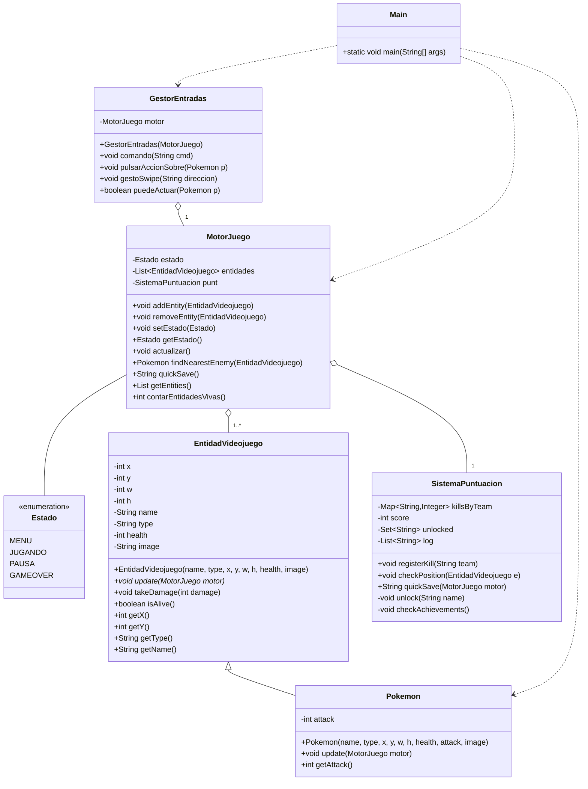
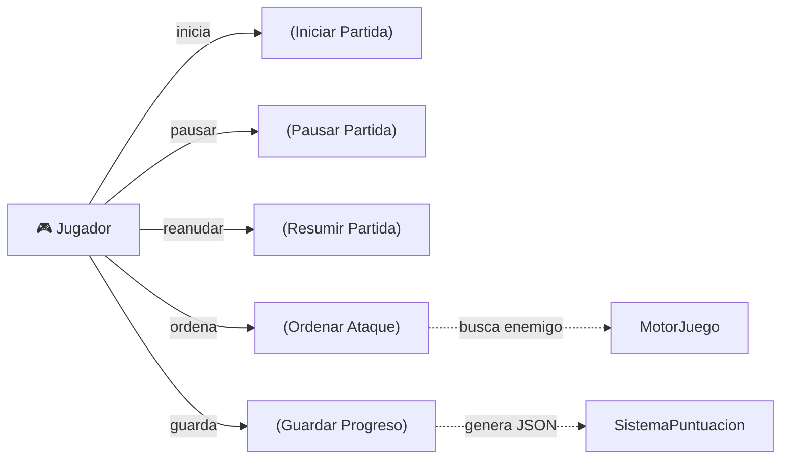

# Motor Pokémon - Simulación de núcleo de juego 2D

Tema: Simulación de un enfrentamiento Pokémon simplificado (4 Pokémons totales, 2 por equipo) sin interfaz gráfica.

## Checklist de requisitos
- [x] Implementación Java con máximo 6 clases: `Main`, `MotorJuego`, `EntidadVideojuego`, `Pokemon`, `GestorEntradas`.
- [x] Control de estado del juego (INICIAR, PAUSA, RESUMIR, GAMEOVER).
- [x] Método `actualizar()` en `MotorJuego` que recorre entidades e imprime logs.
- [x] Añadir/Eliminar entidades en tiempo de ejecución.
- [x] Simulación de inputs táctiles por `GestorEntradas`.
- [x] UML en Mermaid integrado.
- [x] 2 Casos de uso detallados con la plantilla requerida.
- [x] Bitácora del uso de IA y prompts.
# Motor Pokémon - Simulación de núcleo de juego 2D

Tema: Simulación de un enfrentamiento Pokémon simplificado (4 Pokémons totales, 2 por equipo) sin interfaz gráfica. Implementación orientada a prueba por consola.

## Checklist de requisitos
- [x] Implementación Java con máximo 6 clases: `Main`, `MotorJuego`, `EntidadVideojuego`, `Pokemon`, `GestorEntradas`, `SistemaPuntuacion`.
- [x] Control de estado del juego (INICIAR, PAUSA, RESUMIR, GAMEOVER).
- [x] Método `actualizar()` en `MotorJuego` que recorre entidades e imprime logs.
- [x] Añadir/Eliminar entidades en tiempo de ejecución.
- [x] Simulación de inputs táctiles por `GestorEntradas` (incluye `QUICKSAVE`).
- [x] UML en Mermaid integrado (clases y casos de uso).
- [x] 2 Casos de uso detallados con la plantilla requerida.
- [x] Bitácora del uso de IA y prompts.

## Arquitectura del Software
Diseño minimalista y orientado a objetos con responsabilidades claras:

- `Main`: inicia el motor, crea entidades, y simula el bucle de juego (ticks) y entradas.
- `MotorJuego`: controla el estado global (MENU, JUGANDO, PAUSA, GAMEOVER), mantiene la colección de entidades y coordina la actualización.
- `EntidadVideojuego` (abstracta): atributos comunes (x,y,w,h, nombre, tipo, vida, imagen) y contrato `update()` para comportamiento por entidad.
- `Pokemon`: entidad concreta con atributo `attack` y comportamiento simple (atacar enemigo más cercano o moverse).
- `GestorEntradas`: procesa comandos simulados (`INICIAR`, `PAUSA`, `RESUMIR`, `QUICKSAVE`, `GAMEOVER`) y provee métodos para ordenar acciones a entidades.
- `SistemaPuntuacion`: registra kills, desbloquea logros y genera un `quickSave()` en formato JSON.

Nota: este README incluye diagramas en Mermaid y un lugar para añadir capturas de los mismos.

### Diagrama de Clases (Mermaid)


### Diagrama de Casos de Uso (Mermaid)


## Especificación de Casos de Uso

Caso de Uso 1

| Campo | Descripción |
|---|---|
| Nombre | CU-01 Iniciar Partida |
| Objetivo | Qué pretende conseguir el actor: Permitir al jugador iniciar una sesión de juego y arrancar el bucle de actualización. |
| Actor Principal | Jugador |
| Precondiciones | Motor en estado MENU. |
| Flujo Principal | 1. Jugador envía comando INICIAR.  
2. `GestorEntradas` procesa el comando y cambia estado a JUGANDO.  
3. `Main` arranca el bucle de ticks y `MotorJuego.actualizar()` se llama periódicamente. |
| Flujos Alternativos | - Si el motor ya está en estado JUGANDO, el comando INICIAR no cambia el estado. |
| Postcondiciones | Motor en estado JUGANDO; las entidades comienzan a actualizarse cada tick. |
| Reglas de Negocio | No se puede iniciar si el estado no es MENU. |

Caso de Uso 2

| Campo | Descripción |
|---|---|
| Nombre | CU-02 Ordenar Ataque |
| Objetivo | Qué pretende conseguir el actor: Ordenar a un Pokémon aliado atacar al enemigo más cercano. |
| Actor Principal | Jugador |
| Precondiciones | Motor en estado JUGANDO; el Pokémon aliado seleccionado debe estar vivo. |
| Flujo Principal | 1. Jugador selecciona un Pokémon aliado y pulsa ACCION (simulado con `pulsarAccionSobre`).  
2. `GestorEntradas` localiza al enemigo más cercano mediante `MotorJuego.findNearestEnemy`.  
3. Si existe objetivo, se aplica daño igual al ataque del Pokémon.  
4. Si la vida del objetivo <= 0, `MotorJuego` lo elimina y `SistemaPuntuacion` registra la kill. |
| Flujos Alternativos | - Si no hay enemigos cercanos, se informa al jugador y no se hace daño. |
| Postcondiciones | Estado de entidades actualizado; posible desbloqueo de logros si se cumplen condiciones. |
| Reglas de Negocio | Un Pokémon solo puede atacar a entidades de distinto `type` (equipo). |

## Bitácora del Uso de Inteligencia Artificial

Herramienta utilizada y rol asignado:

- ChatGPT: Asistencia de diseño y generación de código, revisión iterativa y ayuda con commits y documentación.

Prompts exactos usados (ejemplos):

Prompt 1:
"Genera en Java un motor de juego simple con máximo 6 clases: Main, MotorJuego, EntidadVideojuego, GestorEntradas, y una clase concreta Pokemon. Debe haber un método actualizar() que recorra entidades e imprima logs. Crea 4 pokemons, 2 en cada equipo."

Prompt 2:
"Añade un SistemaPuntuacion que registre kills y permita un quickSave en formato JSON; integra el sistema en MotorJuego para desbloquear logros." 

Control de Errores de la IA:

- Error detectado: la IA inicialmente propuso diseños con más clases y responsabilidades distribuidas en exceso. Le pedí restringir el diseño a 6 clases y consolidar funciones en `SistemaPuntuacion` en lugar de nuevas clases.  
- Error de implementación: en una iteración la IA generó código con demasiadas clases auxiliares y un `switch` clásico; lo transformé a rule-switch y convertí clases anónimas a lambdas por estilo y compatibilidad.

Reflexión Crítica:

- Ventajas: acelera el prototipado, ofrece ideas estructuradas y ayuda con boilerplate.  
- Peligros: puede proponer sobre-ingeniería, suponer APIs no presentes o introducir cambios sintácticos no compatibles con la versión local de Java; siempre requiere supervisión humana y pruebas.

## Cómo ejecutar
Compilar y ejecutar con JDK (desde carpeta raíz del proyecto):

```powershell
javac -d out src/*.java
java -cp out Main
```

Try it: tras compilar, la simulación imprimirá ticks, eventos de combate, desbloqueo de logros y el JSON del QuickSave en consola.

---

Hecho: motor de juego básico con 4 Pokémons (2 por equipo), logros y quicksave integrado.
